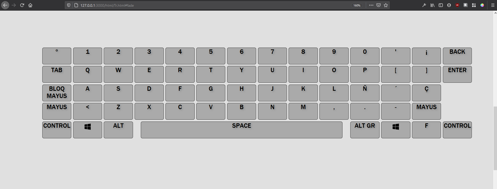
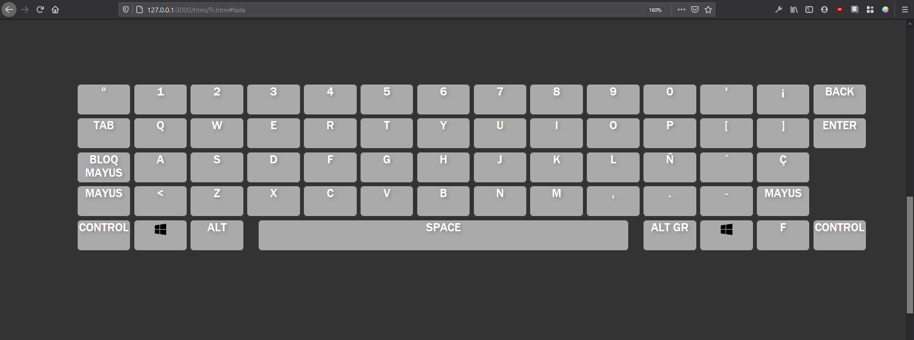
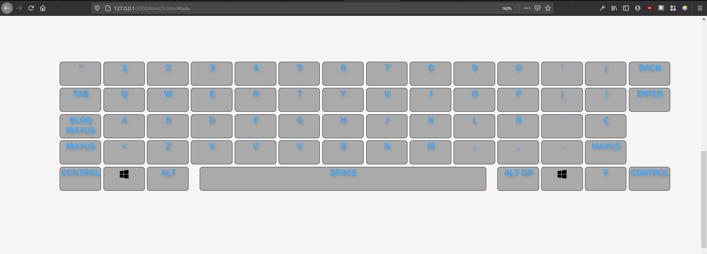
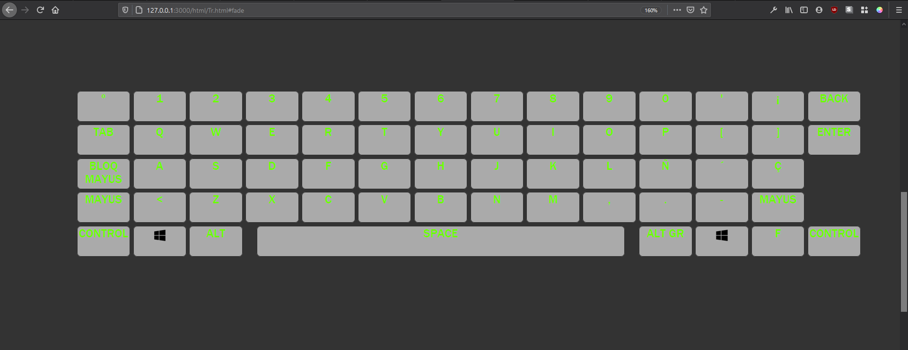

# HTML-keyboard
A modular visual interactive keyboard for webpages, including HTML, CSS and JavaScript.

# Description

This is a small HTML-CSS-Javascript combo I wrote to display a keyboard in a webpage. 
You can customize it through the CSS file.

# Screenshots

Here are some example screenshots:

# Use it

Fork and enjoy!
